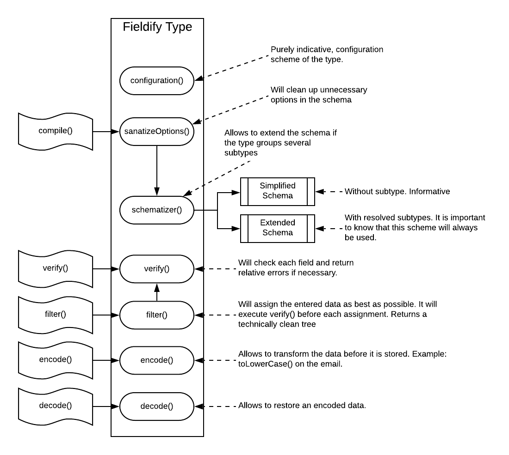

# Fieldify Type Manager

The Fieldify Type Manager provides a set of functionalities for managing types in Fieldify JS. This documentation aims to guide developers in understanding the internal operations of Fieldify and developing new Fieldify types.

## Summary

- [Structure](#structure)
- [`schematizer()`](#schematizer)
- [`sanitize(controller)`](#async-sanitizecontroller)
- [`async verify(data)`](#async-verifydata)
- [`async stringify(data)`](#async-stringifydata)
- [`async parse(data)`](#async-parsedata)
- [Structure of "data"](#structure-of-data)
- [`configuration`](#configuration)
- [Implementing a Type](#implementing-a-type)
## Structure

Fieldify includes an internal object that manages types in different states. This object is defined in the [type.js](./type.js) file and serves as a base object to be inherited by each type during its development. The following diagram illustrates the design of the schema:



### `schematizer()`

The `schematizer()` method is optional and allows transforming a type that requires a single field into a type that utilizes a complete sub-schema. A perfect example is the [DatePickerRange](./DatePickerRange.js) type, which utilizes two DatePickers to define a range. If the type adds fields, it extends the schema that will be used internally.

### `sanitize(controller)`

Before schematization, during compilation, a check is performed on the options used by the developer in their schema. The `sanitize()` method is used to clean up unnecessary options used in the schema. For example, the [Select](./Select.js) type utilizes this method to filter the options.

This method is non-blocking and does not verify the options. It only returns the options that are acceptable for the type. It provides an output of the options that Fieldify accepts.

### `async verify(data)`

The `verify()` method checks the input data of the type. It is executed asynchronously to allow longer checks, especially when the type requires external data that needs to be retrieved.

Referencing the [Email](./Email.js) type would provide further insights.

### `async stringify(data)`

The `stringify()` method stringifies the data before its use. For example, an email address should be stored in lowercase. This method allows adding transformation steps before storage, such as storing a hash in base64.

Referencing the [Email](./Email.js) type would provide further insights.

### `async parse(data)`

The `parse()` method allows restoring the data that was previously stringified using `stringify()`. It is typically used for decoding base64 strings.

### Structure of "data"

The "data" structure is used in the `verify()`, `stringify()`, and `parse()` methods. The following explanation provides a detailed breakdown of the different fields:

```json
{
  "virt": [
    "users",
    "roles"
  ],
  "real": [
    "users",
    "users[1]",
    "roles",
    "roles[2]"
  ],
  "value": "hole",
  "ctrl": {
    "params": {
      "$type": "String"
    },
    "fields": [],
    "array": {},
    "isNested": false,
    "isArray": true,
    "type": {
      "configuration": {}
    }
  },
  "options": {
    "rejectUnknown": true,
    "rejectCast": true,
    "rejectRequired": true
  },
  "error": null,
  "virtLink": "users.roles",
  "realLink": "users.users[1].roles.roles[2]"
}
```

Here's an example of the "data" structure:

- `virt`: An array representing the virtual path of the data, such as ["users", "roles"].
- `real`: An array representing the actual path of the data, such as ["users", "users[1]", "roles", "roles[2]"].
- `value`: The value of the data.
- `ctrl`: An object containing control-related information.
  - `params`: Parameters related to the type, such as {"$type": "String"}.
  - `fields`: An array of nested fields.
  - `array`: An object representing the array structure.
  - `isNested`: A boolean indicating if the type is nested.
  - `isArray`: A boolean indicating if the type is an array.
  - `type`: An object representing the type configuration.
    - `configuration`: The configuration scheme of the type, defined using the Fieldify format.
- `options`: An object containing options related to the type.
  - `rejectUnknown`: A boolean indicating whether unknown options should be rejected.
  - `rejectCast`: A boolean indicating whether casting should be rejected.
  - `rejectRequired`: A boolean indicating whether required fields should be rejected.
- `error`: An optional error message, initially set to null.
- `virtLink`: A virtual link path, such as "users.roles".
- `realLink`: An actual link path, such as "users.users[1].roles.roles[2]".

### `configuration`

The `configuration` variable is purely indicative and defines a scheme that users can apply to configure the type. For example, the String type allows defining limitations such as the minimum or maximum number of characters for the String. This method is not internally useful but provides important information for those who need to interface with the type configuration.

Referencing the [String](./String.js) type would provide further insights. This function must return the configuration scheme of the type in the Fieldify format.

## Implementing a Type

When implementing a new type, it is important to start by correctly inheriting the necessary methods. Below is an example code that includes all the methods from the base object.

```js
const ftExampleVerify = async (data) => {
    data.result = data.value;
};

const ftExampleStringify = async (data) => {
    const params = data.ctrl.params;
    const acceptedTypes = params.$acceptedTypes || 'both';

    if (acceptedTypes === "bigint") {
        data.result = data.value.toString();
    } else {
        data.result = Example(data.value);
    }
};

const ftExampleSanitize = (data) => {
    // No implementation currently
};

const ftExampleSchematizer = (data) => {
    // Implementation here
};

const ftExampleConfig = {
    min: {
        $doc: 'Specify the minimum value',
        $required: false,
        $type: 'Example'
    },
    max: {
        $doc: 'Specify the maximum value',
        $required: false,
        $type: 'Example'
    }
};

const ftExample = {
    stringify: ftExampleStringify,
    parse: ftExampleVerify,
    verify: ftExampleVerify,
    sanitize: ftExampleSanitize,
    schematizer: ftExampleSchematizer,
    configuration: ftExampleConfig
};

module.exports = ftExample;

```

In this code, all the methods from the base object defined in [the ascending object](./type.js) are reimplemented. The `module.exports` statement is used to export references to the type, which will be loaded by the engine.
